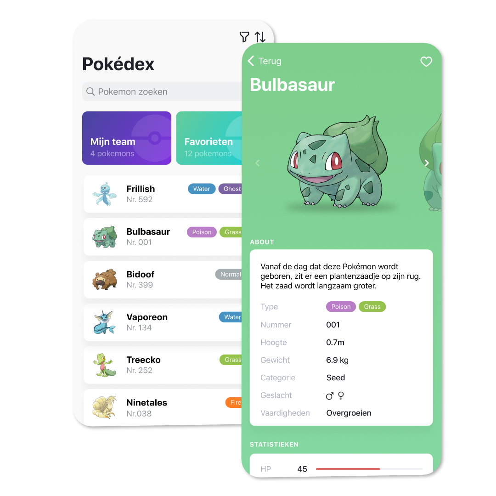
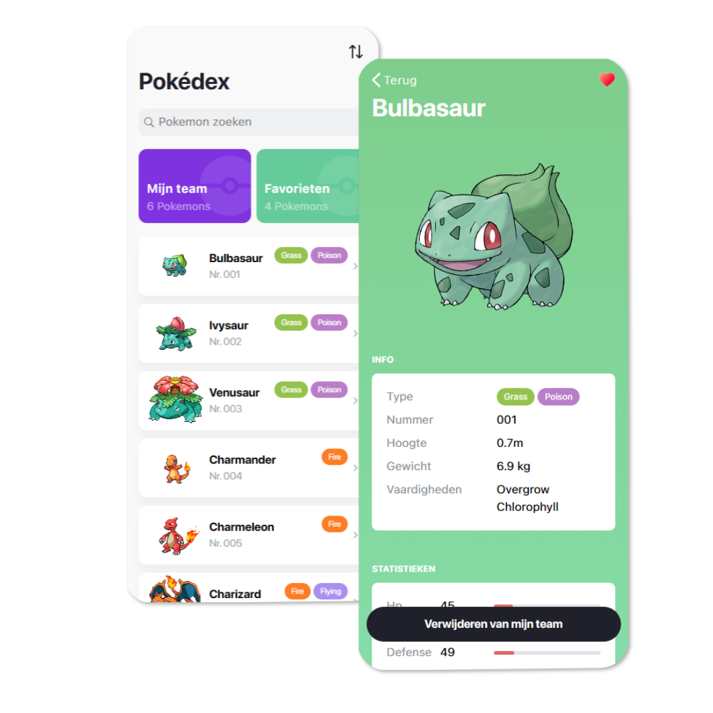

# Pokédex Challenge

A technical test made for [WISEMEN]('https://wisemen.digital/') in December 2022.

## Table of content

## Design

<p align="center">

</p>

## Objective

The client has always been a big fan of the original 151 Pokémon, and would like to have an app that can serve as their Pokédex. They’d like to browse through the Pokemon, search, manage their favourites, and more.

## Requirements

### Functionality

- [x] Trainers can see a list of Pokémon with some general information, such as name, number, picture and types.

- [x] Trainers can search for Pokémon by name and number.

- [x] Trainers can see the details of a Pokémon, with the general info (name, number, picture, types) but also things like abilities, move set and stats.

- [x] Trainers can see a bigger version of the picture of a Pokémon (from the details of one). Include zoom & pan. (for web: we’re looking for a lightbox component)

- [x] Trainers can mark a Pokémon as favourite (or remove it from favourites).

- [x] Trainers have a separate list with only their favourite Pokémon.

<details open>
<summary>Nice to have</summary>
<br>

- [x] Besides their favourites, trainers would also like to manage their team of Pokémon. A trainer’s team is limited to 6 Pokémon.

- [ ] Quite a few trainers have small devices. The list header (title + search) is quite large, it should collapse when scrolling. [LOW PRIORITY FOR WEB]

- [ ] Trainers would like to see more than one picture for Pokémon if available on the detail screen (think carousel like UI).

- [ ] Trainers would like to see the evolutions of a Pokémon if available, from the detail screen. Given a details API response, you’ll need to get the species detail first using https://pokeapi.co/api/v2/pokemon-species/133, from which you can get the evolution chain using https://pokeapi.co/api/v2/evolution-chain/67.

- [x] Trainers are always on the road in search of new Pokémon so they don’t always have the best connection. The customer would like to have loading and error indicators when data can not be found or it takes long too long.

- [ ] Some trainers have large devices. Your implementation should scale gracefully to larger screens. Even better would be to have a “split view”, with the list of Pokémon on the left, and the details of one on the right.

- [x] Some trainers are forgetful, and don’t remember the name or number of a pokemon. Searching by type (such as “fire”) should also be possible.

- [ ] Trainers are used to seeing the stats of a Pokémon in the typical hexagon graph.
</details>

### Functionality

- [x] Working with a JS Framework such as Vue, Angular, …

- [x] Usage of a package manager (npm, pnpm…)

- [x] Make use of routing to reflect the currently selected Pokémon in the URL.

- [x] Make sure the correct Pokémon is displayed when navigating directly to said URL.

- [x] Make the website responsive for different screen sizes (mobile first)

- [x] Make the mobile design a priority

- [x] Make sure the user-specific data (eg: liked Pokémon, etc…) persist between browser sessions

- [x] Make use of the essentials of your framework (when applicable) such as :

  - [x] Components

  - [x] Lifecycle hooks

  - [x] Global state management (e.g. Getting Started | Vuex, Pinia 🍍)

  - [x] Reactivity

  - [x] Data binding

  - [x] Props / slots

  - [x] Routing

- [x] Use of external libraries when applicable (Don’t reinvent the wheel) (e.g. Axios)

<details open>
<summary>Nice to have</summary>
<br>

- [x] Configure a linter to keep your code clean and consistent

- [x] Use Typescript and consistently type all of your functions and custom objects (**Partly.. was learning it on the go.**)

- [x] Use of utility based css frameworks (e.g. Tailwind CSS - Rapidly build modern websites without ever leaving your HTML., Windi CSS)

- [x] Create a ‘404’ page for navigating to URL’s that don’t exist or are invalid

- [x] Use event debouncing/throttling when applicable

- [x] Make sure there is an indicator when loading new data, and make sure no old data is visible when changing selected Pokémon
</details>

## Tools

- [Axios](https://www.npmjs.com/package/axios)
- [Vue JS](https://vuejs.org/)
- [Pinia](https://pinia.vuejs.org/)
- [Vite](https://vitejs.dev/)
- [Tailwind](https://tailwindcss.com/)

## Finished look

<p align="center">

</p>

## Deploy

### Clone

```sh
git clone git@github.com:NickBanken/pokedex-nick-b.git
```

### Install packages

```sh
cd pokedex-nick-b
npm install
```

### Run

```sh
npm run dev
```
